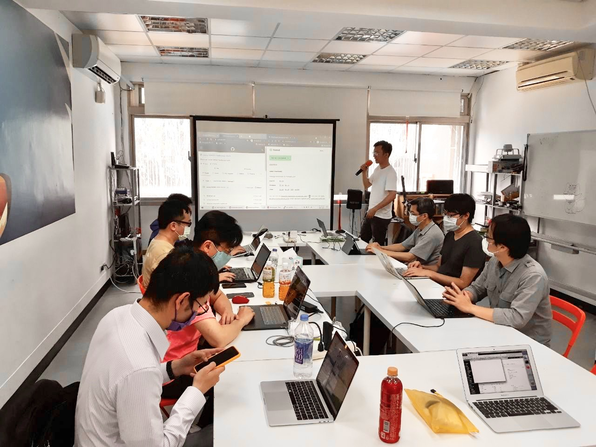

# 2021/05/09 14:15~16:00
【Topic】: Introduction to HashiCorp Nomad  
【Speaker】: Chinghsiang Su  
【Location】: Mozilla Community Space Taipei / 台北市中正區八德路一段94號3樓  
【Sponsor】: Mozilla Taiwan, openSUSE Taiwan  
【Price】: **Free**  
【Link】: https://opensuse-tw.kktix.cc/events/fa53c07d  
【Agenda】:
* Introduction
* What is Nomad
* Glossary
* Architecture
* Start Nomad
* Q & A

